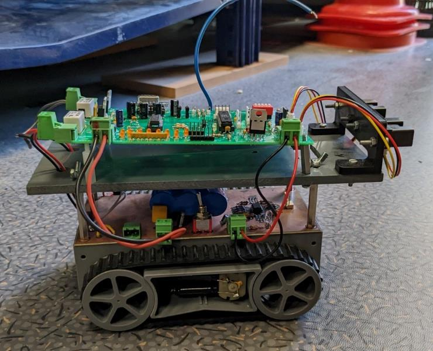
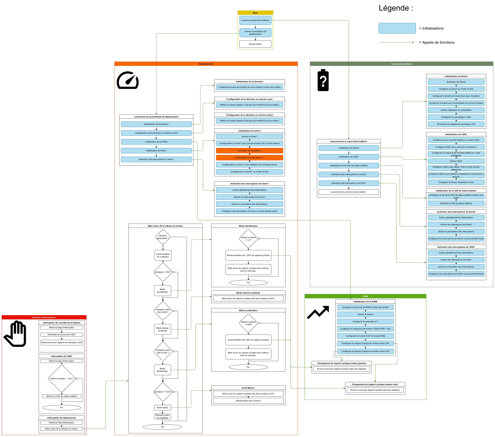

# Robot

Ce projet à été réalisé dans le cadre de mes études à l'école des Mines de Saint-Étienne. Le but était de prendre en main le PIC18f2520 et plus généralement de maîtriser le développement sur microcontrôleur sans OS et sans bibliothèque (en travaillant directement avec les registres)

Le but était de concevoir un robot autonome :

## Architecture

